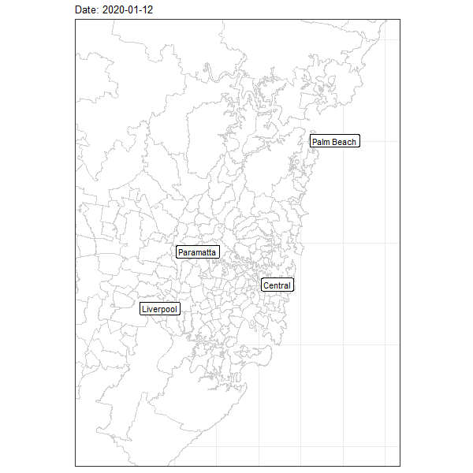

The map below shows COVID-19 cases in Sydney and the surrounding areas. NSW Health publishes the postcode of every COVID-19 case and I plotted each case to a random position within the postcode area. A red dot is a locally acquired infection while a blue dot was acquired overseas. After mandatory hotel quarantine of overseas arrivals is implemented there are no further blue dots. Each dot fades after 14 days. 

The animation plays from the end of January 2020 when the fist cases were detected to mid-October. The impact of lock-down is dramatic with new cases falling substantially. NSW has since progresssively eased restrictions but the the number of new cases remains suppressed. 

{height=80% width=80% }

